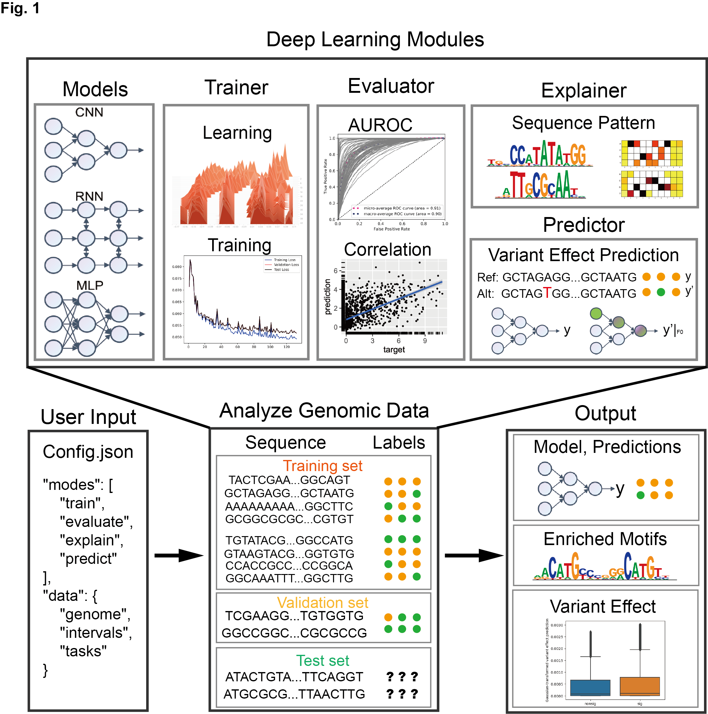

# DeepGeSeq 

DeepGeSeq is a systematic and easy-to-use deep learning toolkit for genomics data analysis. It provides comprehensive support for modern deep learning architectures and analysis pipelines in genomics research.

<div align=center></img></div>

## Key Features

### 1. Model Architectures
- **Modern Deep Learning Support**: Residual Networks (ResNet), Attention Mechanisms (CBAM), Transformers, Customizable architectures
- **Pre-implemented Models**: Re-implementation of published models, Easy model customization, Automatic architecture search

### 2. Training & Evaluation
- **Flexible Training Pipeline**: GPU acceleration support, Early stopping, Checkpoint management, TensorBoard integration
- **Comprehensive Evaluation**: Multiple metrics (AUC, PR, F1, etc.), Cross-validation support, Performance visualization

### 3. Model Applications
- **Motif Analysis**: Motif enrichment analysis, Integration with MEME Suite, HOMER motif search support
- **Feature Attribution**: Gradient-based attribution, Integrated gradients, DeepLIFT support
- **Variant Effect Prediction**: VCF file support, Variant impact scoring, Batch prediction

### 4. Data Processing
- **Multiple Format Support**: FASTA/FASTQ sequences, BED intervals, BigWig signals, VCF variants
- **Efficient Processing**: Parallel data loading, Memory-efficient processing, Strand-aware analysis

## Installation

### Requirements
- Python ≥ 3.7
- PyTorch ≥ 1.10.1
- CUDA support (optional, for GPU acceleration)

### Dependencies
```bash
# Core dependencies
tqdm
numpy
pandas>=0.21
matplotlib==3.0.*
h5py==2.10.0
scikit-learn>=0.21.2
torch>=1.10.1
tensorboard>=2.7.0
```

### Installation Methods

1. **From Source**:
```bash
# Clone repository
git clone https://github.com/JiaqiLiZju/DeepGeSeq.git

# Install
cd DeepGeSeq
python setup.py install
```

2. **Development Installation**:
```bash
# For development and testing
python setup.py develop
```

## Quick Start

### 1. Generate Configuration
```bash
# Generate minimal example config
dgs config --example minimal --output config.json

# Generate full example config
dgs config --example full --output config.json
```

### 2. Basic Runing
```bash
# Train with default settings
dgs run --config config.json
```

### 3. Model Training, Evaluation, Interpretation, and Prediction
```bash
# Train with default settings
dgs {train, evaluate, explain, predict} --config config.json

```

##  Examples

### Input files

Genome file: `GRCh38.p13.genome.fa.gz`

Intervals file: `random_regions.bed`

BigWig file: `hg38.gc5Base.bw`

VCF file: `test.vcf`


### Minimal Configuration
```python
minimal_configs = {
    "modes" : ["train", "evaluate", "explain", "predict"], # define the mode of the run, must be one of the example modes
    "device": "cuda", # define the device to run the model
    "output_dir": "Test", # define the output directory
    "data": { # define the data for the run
        "genome_path": "Test/reference_grch38p13/GRCh38.p13.genome.fa.gz", # define the genome file
        "intervals_path": "Test/random_regions.bed", # define the intervals file, each line is a region, and it defines the data samples
        "target_tasks": [ # define the target tasks for the run
            {
                "task_name": "gc_content", # define the task name
                "file_path": "Test/hg38.gc5Base.bw", # define the file path
                "file_type": "bigwig", # define the file type, currently support "bigwig" and "bed"
            }, # define the second task, etc.
            {
                "task_name": "recomb",
                "file_path": "Test/recombAvg.bw",
                "file_type": "bigwig",                
            }
        ]
    },
    "train": { # define the training settings
        "optimizer": { # define the optimizer
            "type": "Adam", # define the optimizer type
            "lr": 0.001 # define the learning rate
        },
        "criterion": { # define the loss function
            "type": "MSELoss" # define the loss function type, which should be adjusted according to the task, for example, "BCELoss" for binary classification (0/1), "MSELoss" for regression (continuous values)
        }
    },
    "model": { # define the model
        "type": "CNN", # define the model type
        "args":{
          "output_size": 2, # define the model arguments, which should be adjusted according to the task, for example, "output_size" should be equal to the number of tasks
          } 
    },
    "explain":{"target":0}, # define the target task for explanation, which should be adjusted according to the task, for example, "target":0 for the first task
    "predict":{"vcf_path":"Test/test.vcf", # define the vcf file path for prediction
              "sequence_length":1000 # define the sequence length for prediction, which means the length of the sequence to be predicted, it usually should be the same as the sequence length used in model
              }
}
```

### Output files

- `checkpoints/`: Checkpoints for the model parameters

- `Test/metrics/`: Metrics for the model

- `Test/motif_results/`: Motif results for the model

- `Test/predictions/`: Predictions for the model

### Complete Configuration
```python
complete_configs = {
    "modes": ["train", "evaluate", "predict"], # define the mode of the run, must be one of the example modes
    "device": "cuda", # define the device to run the model
    "output_dir": "Test", # define the output directory
    
    "data": { # define the data for the run
        "genome_path": "Test/reference_grch38p13/GRCh38.p13.genome.fa.gz", # define the genome file
        "intervals_path": "Test/random_regions.bed", # define the intervals file, each line is a region, and it defines the data samples
        "target_tasks": [ # define the target tasks for the run 
            {
                "task_name": "gc_content", # define the task name
                "file_path": "Test/hg38.gc5Base.bw", # define the file path
                "file_type": "bigwig" # define the file type, currently support "bigwig" and "bed"
            }, # define the second task, etc.
            {
                "task_name": "recomb", # define the task name
                "file_path": "Test/recombAvg.bw", # define the file path
                "file_type": "bigwig" # define the file type, currently support "bigwig" and "bed"
            }
        ],
        "train_test_split": "random_split", # define the train-test split method, currently support "random_split" and "chromosome_split"
        "test_size": 0.2, # define the test size for the run, and it will be used in "random_split" mode
        "val_size": 0.2, # define the validation size for the run, and it will be used in "random_split" mode
        "test_chroms": ["chr8"], # define the test chromosomes for the run, it should be a list of chromosomes, for example, ["chr8", "chr9", "chr10"], and it will be used in "chromosome_split" mode
        "val_chroms": ["chr7"], # define the validation chromosomes for the run, it should be a list of chromosomes, for example, ["chr7", "chr8", "chr9"], and it will be used in "chromosome_split" mode
        "strand_aware": True, # define whether the data is strand-aware
        "batch_size": 4 # define the batch size for the run
    },
    
    "model": { # define the model
        "type": "CNN", # define the model type
        "args": {"output_size": 2} # define the model arguments, which should be adjusted according to the task, for example, "output_size" should be equal to the number of tasks
    },
    
    "train": { # define the training settings
        "optimizer": { # define the optimizer
            "type": "Adam", # define the optimizer type
            "params": {"lr": 1e-3} # define the optimizer parameters, for example, "lr" is the learning rate
        },
        "criterion": { # define the loss function
            "type": "MSELoss", # define the loss function type, which should be adjusted according to the task, for example, "BCELoss" for binary classification (0/1), "MSELoss" for regression (continuous values)
            "params": {} # define the loss function parameters, for example, "weight" is the weight for the loss function
        },
        "patience": 10, # define the patience for early stopping
        "max_epochs": 500, # define the maximum epochs for the run
        "checkpoint_dir": "checkpoints", # define the checkpoint directory
        "use_tensorboard": False, # define whether to use tensorboard
        "tensorboard_dir": "tensorboard" # define the tensorboard directory
    },
    
    "explain": { # define the explanation settings
        "target": 0, # define the target task for explanation, which should be adjusted according to the task, for example, "target":0 for the first task
        "output_dir": "motif_results", # define the output directory for the explanation
        "max_seqlets": 2000 # define the maximum number of seqlets for the explanation
    },
    
    "predict": { # define the prediction settings 
        "vcf_path": "Test/test.vcf", # define the vcf file path for prediction
        "sequence_length": 1000, # define the sequence length for prediction, which means the length of the sequence to be predicted, it usually should be the same as the sequence length used in model
        "metric_func": "diff", # define the metric function for prediction, currently support "diff" and "mean"
        "mean_by_tasks": True # define whether to mean the prediction by tasks, which means to mean the prediction by tasks, for example, "mean_by_tasks":True for the first task
    }
}
```

## Advanced Usage

Use DeepGeSeq in your own project, you can define your own data, model, and training loop.

### Define your data
```python
from DeepGeSeq.Dataset import SeqDataset
from DeepGeSeq.Data import create_dataloader
class MyData(SeqDataset):
    def __init__(self,
        intervals: Interval,
        genome: Genome,
        targets: Target,
        strand_aware: bool = True
    ):
        super().__init__(intervals, genome, strand_aware)
        # add your own labels here
        self.labels = labels

    def __getitem__(self, idx: int) -> Tuple[np.ndarray, np.ndarray]:
        """Return a sequence and its labels by index."""
        seq = self.seqs[idx]
        label = self.labels[idx]
        return seq.to_onehot(), label

my_dataset = MyData(intervals, genome, labels)
my_dataloader = create_dataloader(my_dataset, batch_size=32, shuffle=True)
```

### Custom Model Development
```python
import torch
from DeepGeSeq.Model import BaseModel

class MyModel(BaseModel):
    def __init__(self, input_size=1000, output_size=1):
        super().__init__()
        self.conv = torch.nn.Conv1d(4, 64, 3)
        self.fc = torch.nn.Linear(64 * (input_size-2), output_size)
    
    def forward(self, x):
        x = self.conv(x)
        x = x.view(x.size(0), -1)
        return self.fc(x)
```

### Custom Training Loop
```python
from DeepGeSeq.DL import Trainer

# Initialize trainer with custom settings
trainer = Trainer(
    model=my_model,
    criterion=torch.nn.BCELoss(),
    optimizer=torch.optim.Adam(my_model.parameters()),
    device=device,
    checkpoint_dir="checkpoints",
    use_tensorboard=True
)

# Train model
trainer.train(
    my_dataloader,
    my_dataloader,
    epochs=100,
    early_stopping=True
)
```

### Evaluate model
```python
# Validate model predictions
predictions, targets = trainer.validate(my_dataloader)

# Evaluate model performance
from DeepGeSeq.DL import Evaluator
metrics = Evaluator.calculate_classification_metrics(targets, predictions)
metrics = Evaluator.calculate_regression_metrics(targets, predictions)
```

### Predict on new data
```python
# model predict on new data
predictions = trainer.predict(my_dataloader)
```

## Contributing

We welcome contributions! Please see our [contributing guidelines](CONTRIBUTING.md) for details.

## Citation

If you use DeepGeSeq in your research, please cite:
```bibtex
@article{li2024deepgeseq,
  title={DeepGeSeq: A systematic deep learning toolkit for genomics},
  author={Li, Jiaqi and Wu, Hanyu and others},
  journal={},
  year={2024}
}
```

## License

This project is licensed under the MIT License - see the [LICENSE](LICENSE) file for details.

## Contact

- Issues: Please use the [GitHub issue tracker](https://github.com/JiaqiLiZju/DeepGeSeq/issues)
- Email: jiaqili@zju.edu.cn

## News
- 2020.03: DeepGeSeq is quite unstable under activate development.
- 2024.10: updating CaseStudies in Manuscript
- 2025.02: updating Documents, Tutorials
