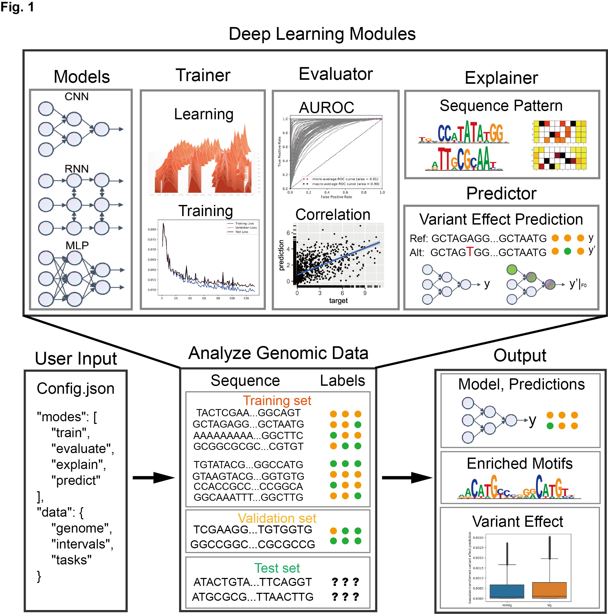

# DeepGeSeq

DeepGeSeq (DGS) is a deep learning toolkit for genomic sequence analysis. It provides end-to-end workflows for training, evaluation, interpretation, and variant effect prediction on sequence-based tasks.

<div align="center"></div>

## What DGS Provides

- Model training and checkpoint management
- Classification/regression evaluation utilities
- Model interpretation (DeepLIFT/SHAP-style attribution + motif workflow)
- Variant effect prediction from VCF
- Genomics data pipeline support for FASTA/BED/BigWig/VCF

## Installation

### Requirements

- Python >= 3.7
- PyTorch environment (CPU or CUDA)

### Install from source

```bash
git clone https://github.com/JiaqiLiZju/DeepGeSeq.git
cd DeepGeSeq
pip install -e .
```

### Install with optional extras

```bash
# explain workflow (Python-side dependency)
pip install -e ".[explain]"

# hyperparameter tuning
pip install -e ".[tune]"

# llm / enformer related modules
pip install -e ".[llm]"

# install all optional extras
pip install -e ".[all]"
```

### Optional runtime dependencies for `explain` mode

`explain` mode depends on additional tools that are not guaranteed by base install:

- `tangermeme` (Python package)
- `modisco` command line tool (must be available in `PATH`)

If these are missing, explanation/motif commands will fail at runtime.

## Quick Start (CLI)

### 1. Generate a config template

```bash
dgs config --example minimal --output config.json
# or
dgs config --example full --output config.json
```

### 2. Run full pipeline from config

```bash
dgs run --config config.json
```

### 3. Run one mode only

```bash
dgs train --config config.json
dgs evaluate --config config.json
dgs explain --config config.json
dgs predict --config config.json
```

## Configuration Notes

### Minimal config (recommended to start)

```json
{
  "modes": ["train", "evaluate", "explain", "predict"],
  "device": "cuda",
  "output_dir": "Test",
  "data": {
    "genome_path": "Test/reference_grch38p13/GRCh38.p13.genome.fa.gz",
    "intervals_path": "Test/random_regions.bed",
    "target_tasks": [
      {
        "task_name": "gc_content",
        "file_path": "Test/hg38.gc5Base.bw",
        "file_type": "bigwig"
      }
    ]
  },
  "model": {
    "type": "CNN",
    "args": {
      "output_size": 1
    }
  },
  "train": {
    "optimizer": {
      "type": "Adam",
      "params": {
        "lr": 1e-3
      }
    },
    "criterion": {
      "type": "MSELoss",
      "params": {}
    }
  },
  "explain": {
    "target": 0,
    "output_dir": "motif_results",
    "max_seqlets": 2000
  },
  "predict": {
    "vcf_path": "Test/test.vcf",
    "sequence_length": 1000,
    "metric_func": "diff",
    "mean_by_tasks": true
  }
}
```

### Important schema detail

For optimizer/loss settings, use nested `params` fields:

- `train.optimizer.params`
- `train.criterion.params`

This matches the current CLI initialization behavior.

## Typical Inputs

- Genome FASTA: `GRCh38.p13.genome.fa.gz`
- Intervals BED: `random_regions.bed`
- Target BigWig/BED: `hg38.gc5Base.bw`
- Variant VCF: `test.vcf`

## Outputs

Common outputs produced by CLI runs:

- `checkpoints/best_model.pt` and `checkpoints/final_model.pt`
- `<output_dir>/metrics.csv` (evaluation)
- `<output_dir>/variant_predictions.csv` (prediction)
- `<explain.output_dir>/` motif outputs (explain)
- `<output_dir>/<output_dir>_<timestamp>.log` (runtime log)

## Python API Examples

### Build a custom dataset

```python
import numpy as np
from typing import Tuple

from DGS.Data import SeqDataset, create_dataloader


class MyData(SeqDataset):
    def __init__(self, intervals, genome, labels, strand_aware: bool = True):
        super().__init__(intervals, genome, strand_aware)
        self.labels = labels

    def __getitem__(self, idx: int) -> Tuple[np.ndarray, np.ndarray]:
        seq = self.seqs[idx]
        return seq.to_onehot(), self.labels[idx]


my_dataset = MyData(intervals, genome, labels)
my_loader = create_dataloader(my_dataset, batch_size=32, shuffle=True)
```

### Build and train a model

```python
import torch

from DGS.DL.Trainer import Trainer


model = torch.nn.Sequential(
    torch.nn.Conv1d(4, 64, kernel_size=3),
    torch.nn.ReLU(),
    torch.nn.Flatten(),
    torch.nn.Linear(64 * 998, 1)
)

trainer = Trainer(
    model=model,
    criterion=torch.nn.BCELoss(),
    optimizer=torch.optim.Adam(model.parameters(), lr=1e-3),
    device=torch.device("cuda" if torch.cuda.is_available() else "cpu"),
    checkpoint_dir="checkpoints",
    use_tensorboard=True
)

trainer.train(train_loader=my_loader, val_loader=my_loader, epochs=10, early_stopping=True)
```

### Evaluate

```python
from DGS.DL.Evaluator import calculate_classification_metrics

avg_loss, avg_metric, predictions, targets = trainer.validate(my_loader, return_predictions=True)
metrics = calculate_classification_metrics(targets, predictions)
```

### Predict

```python
predictions = trainer.predict(my_loader)
```

## Tutorials

See the `Tutorials/` directory for notebook-based walkthroughs.

## Contributing

Issues and pull requests are welcome:

- Issues: https://github.com/JiaqiLiZju/DeepGeSeq/issues

## Citation

If you use DeepGeSeq in your research, please cite:

```bibtex
@article{li2024deepgeseq,
  title={DeepGeSeq: Deep learning library for Genomic Sequence modeling and analysis},
  author={Jiaqi Li},
  journal={},
  year={2024}
}
```

## License

This project is licensed under the BSD 3-Clause License. See [LICENSE](LICENSE).

## Contact

- Email: jiaqili@zju.edu.cn

## News

- 2024.10: Updating case studies in manuscript
- 2025.02: Updating documents and tutorials
